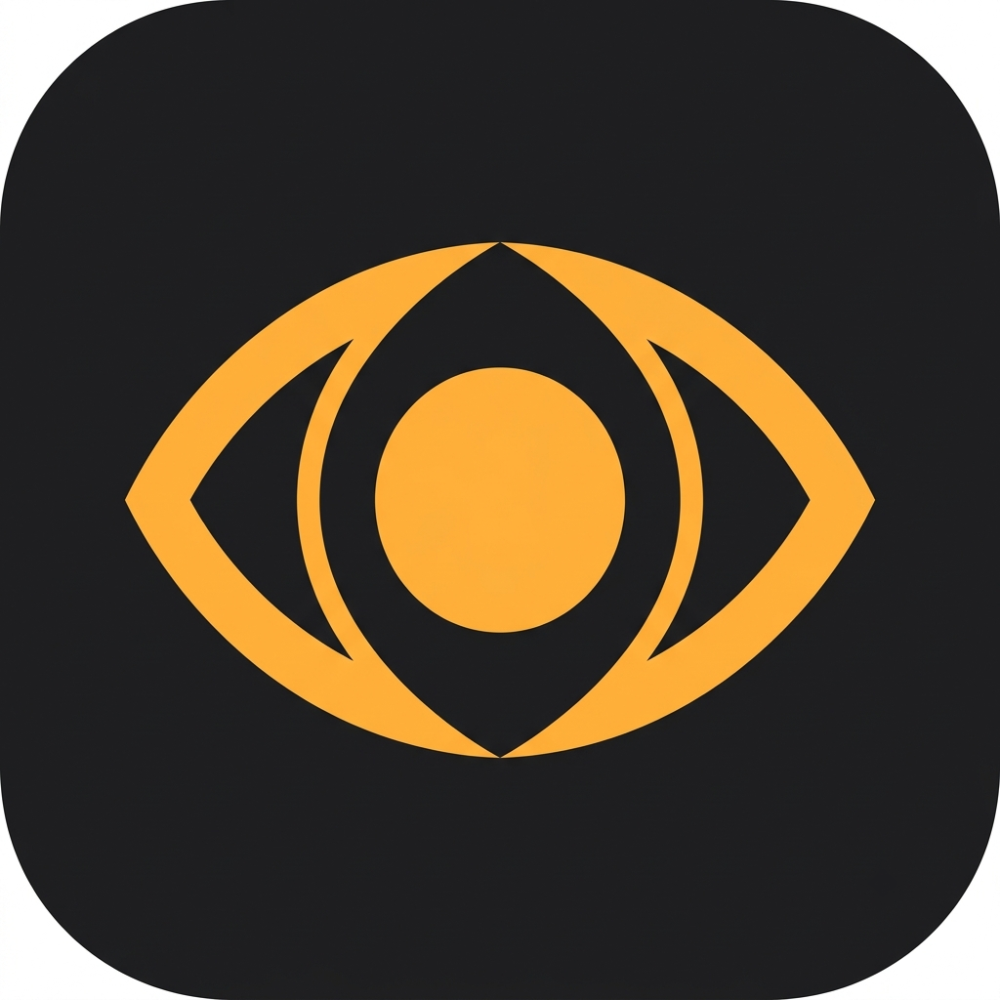

# Vigil



Keeps your Mac awake while AI coding agents are working — and lets it sleep the moment they stop.

Agents like Claude Code and Codex run for minutes at a stretch with no keyboard
input. macOS sees an idle machine and sleeps it, killing the run. Blanket
keep-awake tools fix that by never letting your Mac sleep at all. Vigil holds a
wake lock only while an agent is actually mid-task, and releases it as soon as
the work finishes.

> **Status: early but usable.** The menu bar app runs, detects Claude Code
> sessions, and holds and releases the wake lock correctly. Lid-closed support,
> notifications and signed releases are not done yet — see
> [Not done yet](#not-done-yet).

## Why not just use `caffeinate`?

`caffeinate` and its GUI wrappers keep the Mac awake for a fixed duration or
until you turn them off. Both fail the same way: you forget, and your laptop
runs hot in a bag all night. Vigil ties the wake lock to observed agent activity
and enforces guardrails you actually want:

- Releases the hold when your Mac runs hot, on mains power too
- Stops at a battery floor (default 20%)
- Optional mains-power-only mode
- Respects macOS Low Power Mode
- Expires sessions that stop reporting, so a crashed agent can't pin your Mac awake

It also shows you **every** reason your Mac is awake — including assertions held
by other apps, not just its own.

## Install

Requires macOS 14 or later. There is no signed release yet, so build it:

```sh
git clone https://github.com/Rupareliaaniket22/vigil
cd vigil
make run
```

Press **⌥⌘L** anywhere to toggle the manual hold.

Then open the menu bar icon and click **Set up**. Vigil finds the agents you
have installed — Claude Code, Codex, Gemini CLI and Cursor — adds a hook to
each one's settings, keeps a backup of every file it touches, and leaves any
other hooks you have in place.

## Build from source

You need **only the Command Line Tools** — full Xcode is not required:

```sh
xcode-select --install

make build     # debug build
make test      # run the suite
make bundle    # universal, signed .app in dist/
make run       # build and launch
```

## How it works

Agent hooks post lifecycle events to a Unix socket in your home directory. A
pure state machine turns those into a wake decision; the app holds or releases a
standard `IOPMAssertion`.

```
hooks  ──▶  bridge (unix socket)  ──▶  SessionStore  ──▶  WakePolicy
                                                             │
                                          ┌──────────────────┴─────────┐
                                          ▼                            ▼
                                   IOPMAssertion              ClamshellBackend
                                  (no privileges)              (needs root)
```

The wake hold needs no admin rights and no entitlements — it is the same
mechanism `caffeinate` uses. Only lid-closed operation requires elevation, and
that is opt-in and isolated behind a single protocol.

A Unix socket is used rather than a localhost TCP port because loopback ports
are reachable by every other user account on the machine.

## Not done yet

- **Lid-closed operation — asks for your password once.** Turn on "Keep working
  with the lid closed" in Settings and Vigil installs a small root-owned helper
  that can change that one setting and nothing else. Read
  [SECURITY.md](SECURITY.md) for exactly what it grants. If you would rather do
  it yourself, `sudo ./Scripts/install-clamshell.sh` does the same thing, and
  `--uninstall` removes it.
- **Notifications** when a run finishes or the battery floor is hit.
- **A signed, notarized release.** Until then it is build-from-source only.
- **OpenCode.** It uses a JavaScript plugin rather than shell hooks, which is a
  different mechanism from the four supported agents.

## Contributing

See [CONTRIBUTING.md](CONTRIBUTING.md). Security policy: [SECURITY.md](SECURITY.md).

## License

[Apache License 2.0](LICENSE).
