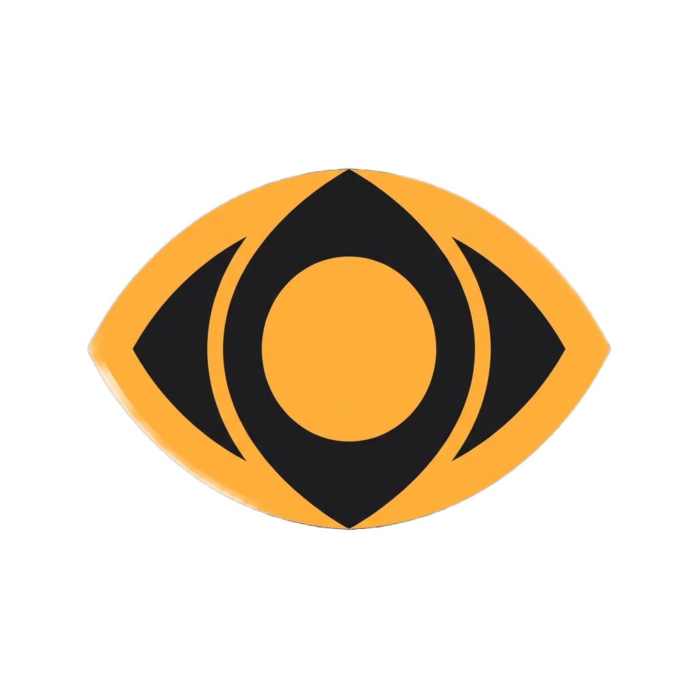
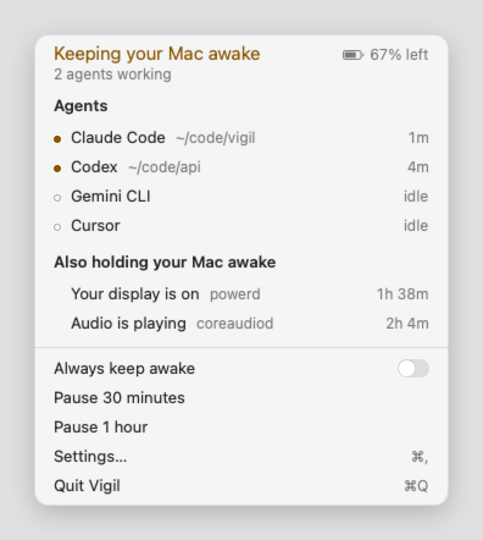
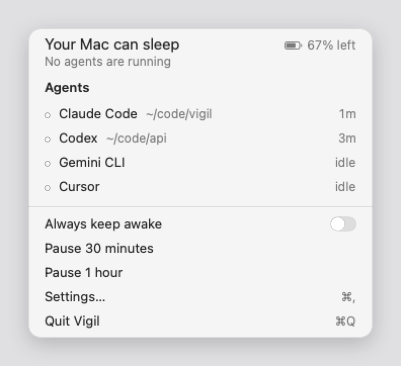
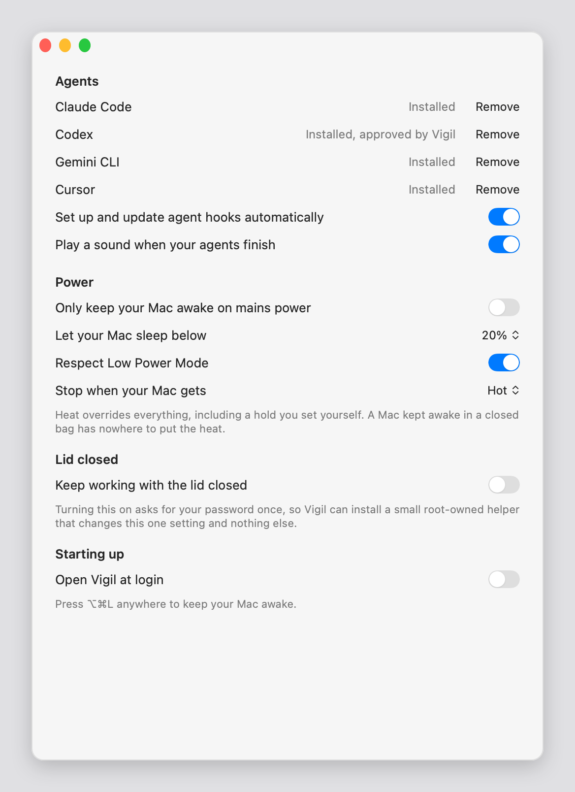

<div align="center">



# Vigil

**Keeps your Mac awake while your AI agents work.**
Not a minute longer.

<br>

[](https://www.apple.com/macos/)
[](https://www.apple.com/macos/)
[](https://swift.org)
[](Tests)
[](LICENSE)

<br>

<picture>
  <source media="(prefers-color-scheme: dark)" srcset="docs/assets/panel-dark.png">
  
</picture>

</div>

<br>

Vigil is a menu bar app that holds your Mac awake while a coding agent is
actually working, and lets it sleep again the moment that stops. It reads the
lifecycle hooks your agents already expose, so it knows the difference between a
run in progress and a terminal left open.

<div align="center">
<br>

<picture>
  <source media="(prefers-color-scheme: dark)" srcset="docs/assets/hold-release-dark.gif">
  
</picture>

<sub>One run, start to finish. The hold appears when work does, and goes when it goes.</sub>

</div>

> [!NOTE]
> Vigil is early. It works, and it's tested, but there's no signed release yet —
> build it from source for now. See [Not done yet](#not-done-yet).

## Install

> [!IMPORTANT]
> **Vigil wires your agents up the moment it launches, without asking** — and
> the command below is that moment, not a later click. Read this first.
>
> On launch, Vigil looks for Claude Code, Codex, Gemini CLI and Cursor and
> writes a hook into the config of each one it finds:
> `~/.claude/settings.json`, `~/.codex/hooks.json`, `~/.gemini/settings.json`,
> `~/.cursor/hooks.json`. Codex runs no hook it has not approved, so Vigil also
> writes a trust record for its own entries into `~/.codex/config.toml`.
>
> Every file is copied to `<file>.vigil-backup` before its first edit, nothing
> else in it is changed, and a file Vigil cannot parse is left alone rather than
> rewritten. The menu bar panel says which agents it set up and offers
> **Undo**, which takes the hooks, the shared script and the trust record back
> out.
>
> To decide for yourself from then on, turn off **Set up and update agent hooks
> automatically** in Settings. Nothing more is written until you press
> **Set up** on an agent — but the first launch has already happened by the
> time you can reach that switch, so it does not help you look before Vigil
> writes.
>
> To look first, build without launching and start the app with that switch
> already off for this one run:
>
> ```sh
> make bundle
> dist/Vigil.app/Contents/MacOS/Vigil -managesAgentHooks '<false/>'
> ```
>
> Vigil then writes nothing until you press **Set up**. Run the binary
> directly: `make run` and a plain `open dist/Vigil.app` pass no arguments, so
> the switch never reaches the app. And spell it `'<false/>'` — `false`, `NO`
> and `0` arrive as strings, which is not the same as `false` and is ignored.

```sh
git clone https://github.com/Rupareliaaniket22/vigil
cd vigil
make run
```

Requires macOS 14 or later. No Xcode needed — Command Line Tools is enough.
Budget about **1 GB of free disk** and two to three minutes: `make run` builds
a release slice for each architecture and fuses them into one binary. (Measured
from a clean clone: 2m08s, 503 MB of build output.)

Open the menu bar icon and you should see your agents listed. [SECURITY.md](SECURITY.md#writing-into-other-programs-config-files)
has the full account of what gets written and what bounds it.

## Features

- **Holds only while work is happening.** Reads real lifecycle hooks from
  **Claude Code**, **Codex**, **Gemini CLI** and **Cursor**
- **Shows everything keeping your Mac awake** — not just its own hold. When
  another app is the reason, it says so, and for how long
- **Stops before your Mac does** — heat, battery floor, mains-only and Low Power
  Mode all outrank the agents
- **Works with the lid closed**, if you want it to
- **Tells you when a run finishes**, and warns if one is cut short
- **⌥⌘L** from anywhere to hold your Mac awake regardless

## Guardrails

A keep-awake tool that never lets go is a fire hazard, so these come first:

| | |
| :-- | :-- |
| **Heat** | Releases when your Mac runs hot — on mains power too, and it beats a manual hold |
| **Battery** | Stops below a charge you choose, and asks your Mac to sleep rather than merely allowing it |
| **Mains only** | Optional: never hold on battery |
| **Low Power Mode** | Respected |
| **Crashed agents** | A session that stops reporting expires, so it can't pin your Mac awake |

Every one of them is a switch, and every switch says what it will do rather than
what it is called:

<div align="center">
<br>

<picture>
  <source media="(prefers-color-scheme: dark)" srcset="docs/assets/settings-dark.png">
  
</picture>

</div>

<br>

## Working with the lid closed

Off by default. Turning it on asks for your password once, because changing
lid-close behaviour needs root.

Vigil installs a small root-owned helper that can change **that one setting and
nothing else** — three fixed arguments, no shell, no wildcards. The installer
refuses unless every directory on the path to it is root-owned.

[SECURITY.md](SECURITY.md) has the full threat model.

## How it works

The wake lock itself needs no privileges — it's the same mechanism `caffeinate`
uses. Agent hooks post to a Unix socket in your home directory, a pure function
decides whether to hold, and only lid-closed operation touches root.

A Unix socket rather than a localhost port, because `127.0.0.1` is reachable by
every other user account on the machine.

## Not done yet

- **No signed release.** Build from source for now. A source build is
  *ad-hoc* signed, which has one consequence worth knowing before it puzzles
  you: an ad-hoc signature identifies one exact build and nothing else, so
  **every `make run` is a different program as far as macOS is concerned.**
  Any permission you grant Vigil — notifications, most visibly — is granted to
  that build alone, and the next rebuild has to ask again. A Developer ID
  signature fixes this permanently; nothing else does
- **No auto-update.** There is no update check at all. A new version means
  pulling and rebuilding, and nothing will tell you there is one
- **OpenCode** uses a JavaScript plugin rather than shell hooks
- **Desktop apps other than Cursor.** Claude and ChatGPT desktop publish no
  lifecycle events and hold no wake lock of their own, so Vigil cannot see
  them working. It will not guess: an idle window and one waiting on the
  model look the same from outside

## Uninstall

```sh
Scripts/uninstall.sh --dry-run   # say what would go, change nothing
Scripts/uninstall.sh
```

A copy ships inside the app, at
`Vigil.app/Contents/Resources/uninstall.sh`, because the app is what most
people will have. **Run it before you drag Vigil to the Trash** — some of what
it removes can only be removed by the script that goes in the Trash with it.

Dragging Vigil to the Trash on its own leaves: hook entries in up to four
config files, the shared hook script at `~/.vigil/hooks/vigil-hook.sh`, a
`<file>.vigil-backup` copy beside each config, the trust records Vigil wrote
into `~/.codex/config.toml`, a socket under
`~/Library/Application Support/Vigil`, its preferences, a login item, and — if
you ever turned on lid-closed working — a passwordless `sudo` rule at
`/etc/sudoers.d/vigil-clamshell` and a root-owned helper in
`/Library/PrivilegedHelperTools`. The last two are root-level leftovers from an
app that no longer exists.

Two things the script deliberately does **not** do:

- **It does not edit your agents' config files.** Taking a hook entry out means
  rewriting your JSON or TOML around it without disturbing anything else, which
  is what Vigil does in Swift, with tests, and what a shell script cannot do
  safely. Remove the hooks from inside the app first — open **Settings…** from
  the panel, then **Vigil → Remove Vigil from This Mac…** in the menu bar,
  which takes them out of every agent at once and withdraws the Codex trust
  records. (The menu bar only shows Vigil's own menu while its Settings window
  is open; an accessory app has no menu of its own otherwise. **Settings → each
  agent → Remove** does the same thing one agent at a time.) The script then
  confirms the files are clean, and tells you which still have entries if you
  skipped this.
- **It does not delete your backups.** The `.vigil-backup` files are copies of
  *your* config from before Vigil first touched it. It names them and leaves
  them; `--include-backups` deletes them too.

## Building

```sh
make test             # unit tests
make lint             # swift-format, strict
make smoke            # builds the real panel headlessly
make integration      # drives a live app, checks macOS's power state follows
make bundle           # universal, signed .app
```

`make integration` launches Vigil against a throwaway home directory, so it
sets up no agents and touches none of your own config — and it checks that it
did not, rather than assuming.

[CONTRIBUTING.md](CONTRIBUTING.md) · [AGENTS.md](AGENTS.md) · [DESIGN.md](DESIGN.md)

## License

[Apache 2.0](LICENSE)
